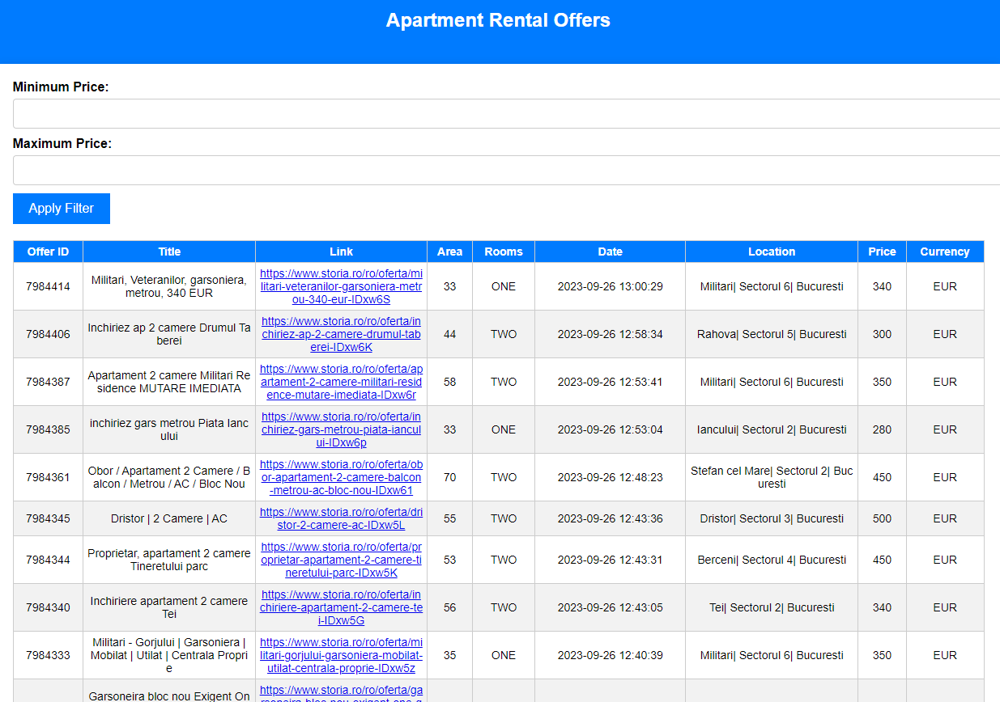

# Web Crawler for Housing 🏠🔍

This project is a comprehensive web crawler designed to empower users with the ability to extract essential property details, prices, and locations from a housing website efficiently. It not only gathers this data but also provides a user-friendly interface for searching and viewing housing offers that match specific criteria.

## Features 🌟

- **Web Scraping:** The crawler utilizes web scraping techniques to extract data from the target housing website, including property details, prices, and locations. It ensures that you always have access to the latest housing information.

- **Optimized Performance:** To enhance web crawling speed, the project employs multithreading and asynchronous programming, ensuring efficient data retrieval. This allows you to gather extensive information swiftly.

- **Real-Time Alerts:** The crawler integrates with Discord to provide automated notifications. Users receive real-time alerts and messages whenever new housing listings meeting their criteria are discovered.

- **Local Web Interface:** Flask, a Python web framework, is used to create a local web server. This server hosts a user-friendly interface that allows you to search for and view housing offers that match your search criteria.

## Local Web Interface 🌐



Flask, a lightweight and flexible Python web framework, is a crucial component of this project. It is used to create a local web server that runs on your machine. This web server serves as the interface for interacting with the housing data extracted by the crawler. Here's how it works:

- **Search Functionality:** You can input your housing search criteria, such as minimum and maximum price, on the web interface.

- **Data Display:** Once you apply the filter, Flask uses HTML, CSS, and JavaScript to display housing offers that match your criteria. These offers are presented in an organized and easy-to-read format.

- **Dynamic Updates:** If you modify your search criteria or if new housing offers are discovered, the web interface dynamically updates to show you the latest results.

## Technologies Used 🛠️

- **Flask:** Flask is the backbone of the local web interface, providing the framework for displaying housing offers.

- **HTML, CSS, and JavaScript:** These web technologies are used to create a visually appealing and interactive user interface.

- **Python:** Python is the primary programming language for both the web crawler and the Flask application.

- **Scrapy:** Scrapy is used for web scraping and data extraction from housing websites, allowing the retrieval of housing offers.

## How to Use 🚀

1. Clone the project repository to your local machine.

2. Install the required dependencies by running:

   ```
   pip install -r requirements.txt
   ```

3. Configure the crawler to target your desired housing website and set your criteria.

4. Run the crawler using Python to gather housing data.

5. Access the local web interface provided by Flask via your browser. Input your search criteria and explore housing offers that match your preferences.

6. Receive real-time alerts and messages through Discord whenever new housing listings are found.

## Contribution 🤝

Contributions to this project are welcome! If you have any ideas for improvements or want to add new features, feel free to open an issue or submit a pull request.

## License 📜

This project is licensed under the [MIT License](LICENSE), which means you are free to use and modify the code for your purposes.
